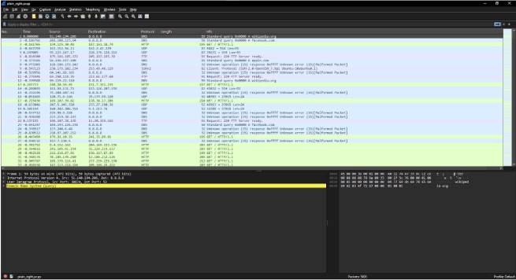
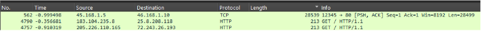
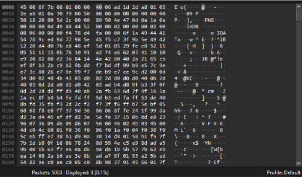
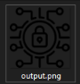
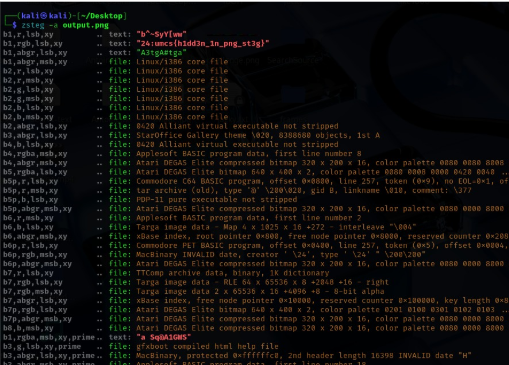

### Hidden In Plain Graphic 

The challenge “Hidden In Plain Graphic” is a forensics challenge which provides a file called **plain\_zight.pcap**. This file contains captured network traffic, which I analyzed using Wireshark.

Upon opening the file, I encountered an abundance of network traffic — 5,003 packets to be exact. Since manually examining each packet would be time consuming, I decided to apply some filters to narrow down my search.

Looking back at the challenge title, I noticed the word “**Graphic**” which suggested that we needed to find an image file within the PCAP. Since image files (PNG, JPG, etc.) typically contain substantial amounts of binary data, I decided to filter packets by length to identify larger transfers.

I discovered an interesting packet (number 562) with a length of 28,539 bytes. This unusually large packet warranted further investigation, so I followed its TCP stream.

Upon inspection, I immediately identified the presence of a PNG file, recognizable by its characteristic header signature (89 50 4E 47 0D 0A 1A 0A in hexadecimal). To extract this image for further analysis, I:

1.  Selected the packet
    
2.  Clicked “Follow TCP Stream”
    
3.  Changed “Show as:” to “Raw”
    
4.  Clicked “Save as” and named the file with a .png extension

After extracting the PNG image, I couldn’t immediately see any flag in the visual content. This suggested that the flag might be hidden using **steganography techniques.**

I used the tool zsteg, which is specifically designed to detect various steganography methods in PNG and BMP files, particularly those using LSB (Least Significant Bit) encoding.

 $ zsteg -a output.png   

And that’s how I found the flag for this challenge!