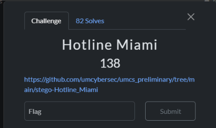
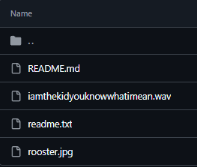
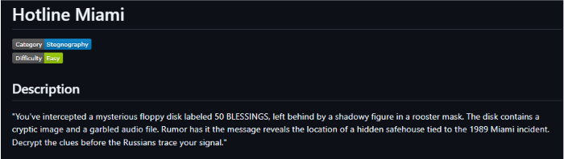
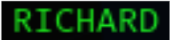
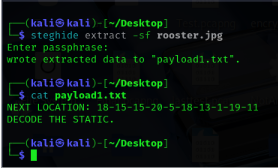
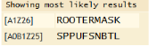
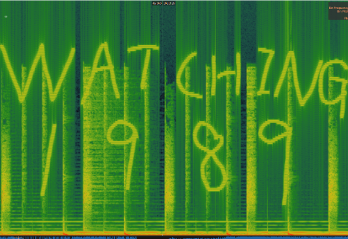

## Hotline Miami
-------------

The Hotline Miami challenge falls under the category of steganography. The challenge provided a GitHub repository containing multiple files, with a challenge description **suggesting we needed to extract hidden information.**

We will first look at the “Rooster.jpg” file. A common practice when dealing with steganography challenges is to examine the strings within image files, as they might contain clues or even the flag itself. Upon inspecting the strings in "Rooster.jpg", I found an interesting keyword:

At the very last line, I discovered the name "**RICHARD**". I instinctively thought this might be a password, so I turned to Steghide, a popular steganography tool capable of extracting files embedded within other files.

 $ steghide extract -sf rooster.jpg

 $ cat payload1.txt

After extraction, I found a seemingly encoded string in the payload1.txt file. After decoding this string (which appeared to substitute numbers for letters), I discovered the word "**ROOSTERMASK**"

For the audio file "iamthekidyouknowwhatimean.wav", I applied techniques specific to audio steganography. A common method involves hiding messages within the audio's spectrogram.

A spectrogram is simply **a picture of sound**. It shows what frequencies (high or low pitches) are present at each moment in an audio file.

In steganography, **people can hide messages by adding specific sounds that form pictures or text when viewed as a spectrogram.** These added sounds are typically so subtle that you **can't hear** them when playing the audio normally.

Using Sonic Visualizer, I viewed the spectrogram by:

1.  Opening the audio file
    
2.  Adding a spectrogram view (Layer → Add Spectrogram)
    

The resulting spectrogram revealed a hidden message showing the phrase "**BE WATCHING**" and the year "**1989**", which were visually encoded into the frequency components of the audio file but completely inaudible during normal playback.

Referring back to the readme.txt provided with the challenge, I found instructions indicating that the flag should be constructed in the format: **Subject\_Be\_Verb\_Year**

From my analysis, I had gathered the following:

*   **Subject** \= Richard (from the strings output) 
    
*   **Be** \= BE (from the spectrogram)
    
*   **Verb** = WATCHING (from the spectrogram)
    
*   **Year** = 1989 (from the spectrogram)
    

Putting these components together in the specified format, I constructed the flag: umcs{Richard\_Be\_Watching\_1989}

It appears that the "ROOSTERMASK" found in payload1.txt was a decoy meant to mislead solvers.
