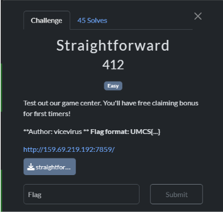
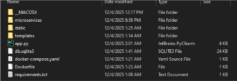
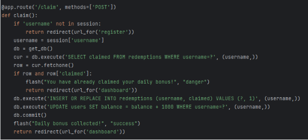
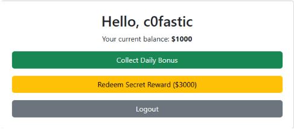
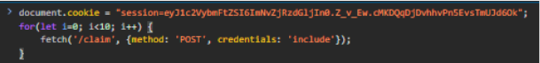
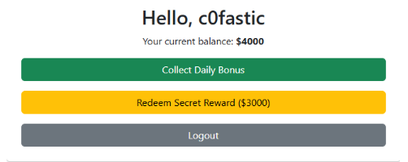
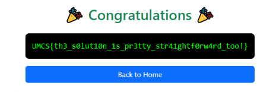

Straightforward
---------------

"Straightforward" is a web exploitation challenge that provides the source code of the web application in a zip file named "straightforward\_player.zip" along with the challenge website URL.

I began by analyzing the source code to identify potential vulnerabilities. After examining the files, I focused on app.py as it contained **the core logic of the web application.**

The application is a simple credit-based system built with Flask and SQLite with the following features:

*   Users can register with just a username to receive an initial balance of 1000 credits
    
*   Users can view their balance on a dashboard
    
*   Users can claim a daily bonus of 1000 credits
    
*   Users can purchase a flag for 3000 credits
    

The application uses session-based authentication and maintains two database tables:

1.  A table for user accounts with their balances
    
2.  A table to track whether users have claimed their daily bonus
    

The intended path to get the flag would require users to **wait multiple day**s to accumulate enough credits (starting with 1000 and gaining 1000 per day) to reach the 3000 credits needed to purchase the flag.

Upon examining the code more carefully, I identified a vulnerability in the claim() function, particularly in how it checks for and updates the "claimed" status.

The vulnerability is a **race condition** that occurs because:

1.  There's a **time gap** between checking if a user has claimed their bonus and updating the database to mark it as claimed
    
2.  The database transaction **isn't properly secured** with locks or an appropriate isolation level
    
3.  The db.commit() only happens **after** both database operations (INSERT/REPLACE and UPDATE), creating a window of opportunity
    

I realized I could exploit this race condition by **sending multiple /claim requests simultaneously:**

*   All requests would check the "claimed" status before any of them update it
    
*   The database would see that the user hasn't claimed their bonus yet (for all requests)
    
*   All requests would pass the check and proceed to update the balance
    
*   Each successful request would add 1000 to the balance
    

I went to the challenge website and registered with a username to establish a session.

I also found out that we could access our session cookies, which would help in **creating a script to simulate simultaneous /claim requests.**

I crafted the following JavaScript script to execute in the browser's developer console:

document.cookie = "session=insert\_your\_cookie\_here";

for(let i=0; i<10; i++) {

    fetch('/claim', {method: 'POST', credentials: 'include'});

}

The script:

1.  Sets the session cookie to maintain authentication
    
2.  Uses a loop to **rapidly send 10 simultaneous** POST requests to the /claim endpoint
    
3.  **Takes advantage of the time gap** between the server's check and update operations
    
4.  Results in **multiple successful bonus claims** instead of the intended single claim per day

After running the script, I refreshed the page and found that my account balance had increased significantly well beyond the 2000 credits I should have had (1000 initial + 1000 from a single claim).

With my new balance fulfilling the required 3000 credits, I was able to purchase the flag from the dashboard.

And that's how I solved the "Straightforward" challenge!